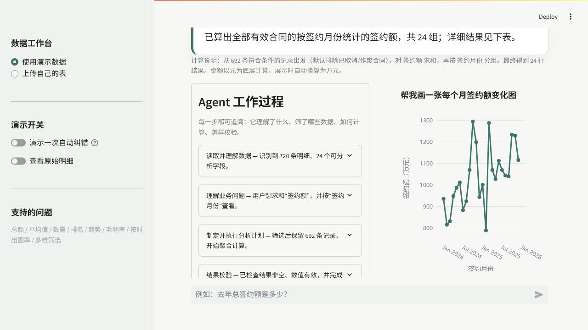
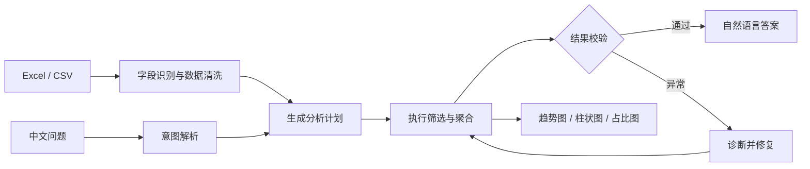
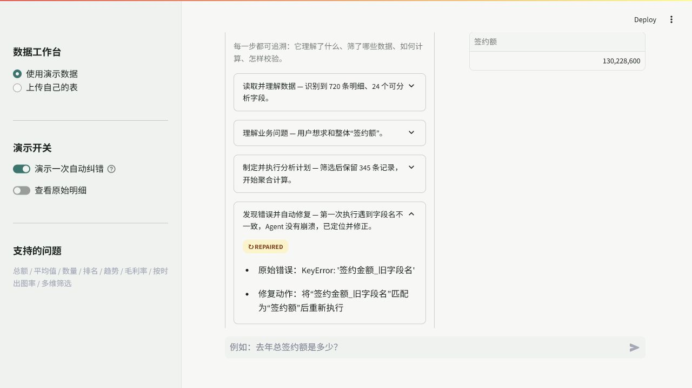
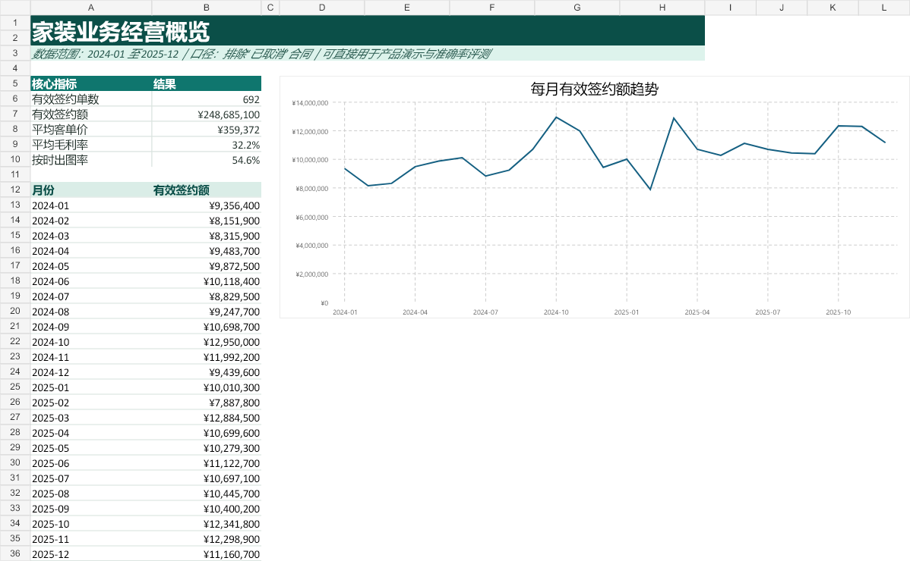
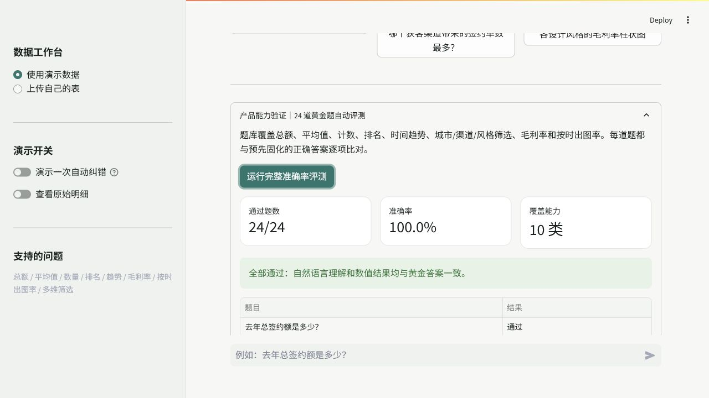

# 家装经营洞察 Agent

把 Excel 交给它，用一句中文提问，直接得到真实计算结果、图表和完整分析过程。


## 为什么做这个产品

家装公司的签约、设计、出图和交付数据通常都在表格里。业务人员知道自己想问什么，却不一定会写公式、做透视表或使用 SQL；传统报表又只能回答预先设定的问题。

家装经营洞察 Agent 把这段距离缩短成一句话：用户负责提问，Agent 负责识别数据、规划计算、执行、校验和解释。它既给结论，也把“怎么算的”完整展示出来。

## 主要功能

| 能力 | 产品表现 |
| --- | --- |
| 中文自然语言分析 | 理解“去年”“前三”“各城市”“每个月”等业务表达 |
| 真实数据计算 | 从上传的 Excel/CSV 明细中筛选、分组、求和、求平均和计算比例 |
| 多维经营分析 | 支持城市、门店、设计师、客户经理、风格、渠道、户型和交付状态 |
| 自动图表 | 根据问题选择折线图、柱状图或占比图 |
| 过程可追溯 | 展示数据理解、意图识别、筛选、聚合、校验、可视化每一步 |
| 错误自动恢复 | 自动识别常见字段别名；执行异常时捕获错误、修正字段并重试 |
| 准确率评测 | 内置 24 道黄金题，逐项比对意图和数值结果 |
| 离线可用 | 核心计算无需 API Key，不上传业务数据 |



## 30 秒开始使用

### Windows

1. 下载或克隆本项目。
2. 双击根目录里的 `run_app.bat`。
3. 第一次运行会自动安装依赖，完成后浏览器会打开产品。

也可以在 PowerShell 中运行：

```powershell
.\start.ps1
```

### macOS / Linux

```bash
python -m venv .venv
source .venv/bin/activate
pip install -r requirements.txt
streamlit run app.py
```

产品打开后默认加载演示数据，无需准备文件。更完整的操作说明见 [小白使用手册](docs/USER_GUIDE.md)。

## 可以直接问什么

```text
去年总签约额是多少？
签约额最高的前三种设计风格是什么？
帮我画一张每个月签约额变化图
2025年各城市的平均客单价
哪个获客渠道带来的签约单数最多？
各设计风格的毛利率柱状图
去年南京的总签约额
2025年的按时出图率是多少？
```

## Agent 如何工作



1. 读取表格，识别日期、金额、分类字段和常见字段别名。
2. 把问题拆成指标、计算方式、分组维度、时间范围、筛选条件和图表类型。
3. 生成可审计的分析计划并在明细数据上执行。
4. 用独立规则检查结果是否为空、数值是否合法、关键合计是否一致。
5. 如遇字段不一致或类型异常，记录错误、匹配正确字段并重新执行。
6. 输出普通人能读懂的结论、计算口径、结果表和图表。



## 演示数据

项目提供一份可直接使用的 [家装业务演示数据.xlsx](outputs/home-deal-insight-agent/家装业务演示数据.xlsx)，包含：

- 720 条项目明细，时间覆盖 2024-01 至 2025-12；
- 上海、杭州、苏州、南京、宁波 5 个城市；
- 签约额、设计费、预计成本、毛利额；
- 设计风格、房屋类型、获客渠道、门店和人员；
- 合同状态、交付状态、出图日期、出图时长和客户评分；
- `签约明细`、`经营概览`、`字段说明` 3 个工作表；
- Excel 内置公式、筛选、条件格式和趋势图。



数据由固定随机种子生成，不包含任何真实客户隐私，任何人都能复现同一套评测结果。

## 准确率验证

```bash
python evaluation/evaluate.py
```

当前结果：

```text
单元测试：9/9 通过
黄金题评测：24/24 通过
准确率：100.0%
```



题库不只覆盖页面上的示例，还包含不同年份、月份、城市、风格、户型、渠道、排名、取消合同、毛利率和按时出图率。详见 [评测说明](docs/EVALUATION.md)。

## 技术路线

- **产品界面：** Streamlit
- **数据处理：** Pandas + NumPy
- **图表：** Plotly
- **Excel：** openpyxl（产品读取）+ Artifact Tool（演示工作簿生成）
- **自然语言分析：** 中文业务语义解析器 + 可审计任务计划
- **Agent 机制：** 规划、执行、结果校验、异常捕获、字段修复、重试
- **质量保障：** Pytest 单元测试 + 固化黄金答案评测

更详细的内部设计见 [技术设计文档](docs/TECHNICAL_DESIGN.md)。

## 项目结构

```text
home-deal-insight-agent/
├─ app.py                         # Streamlit 产品入口
├─ src/insight_agent/             # 问题理解、计算、校验、图表
├─ outputs/home-deal-insight-agent/
│  └─ 家装业务演示数据.xlsx       # 可直接使用的演示表
├─ evaluation/                    # 24 道黄金题与评测程序
├─ tests/                         # 单元测试
├─ scripts/                       # 演示数据生成脚本
├─ docs/                          # 使用与技术文档
├─ run_app.bat                    # Windows 一键启动
└─ requirements.txt
```

## 数据口径

- 默认只统计有效签约，排除“已取消 / 作废 / 退单”。
- “去年”以电脑当前日期为基准；内置数据在 2026 年运行时对应 2025 年。
- 金额以元计算，结论中自动换算为万元。
- 按时出图定义为出图时长不超过 14 天。
- 毛利率 = 毛利额 ÷ 签约额。

## 文档

- [小白使用手册](docs/USER_GUIDE.md)
- [技术设计文档](docs/TECHNICAL_DESIGN.md)
- [准确率评测说明](docs/EVALUATION.md)
- [演示数据工作簿](outputs/home-deal-insight-agent/家装业务演示数据.xlsx)
