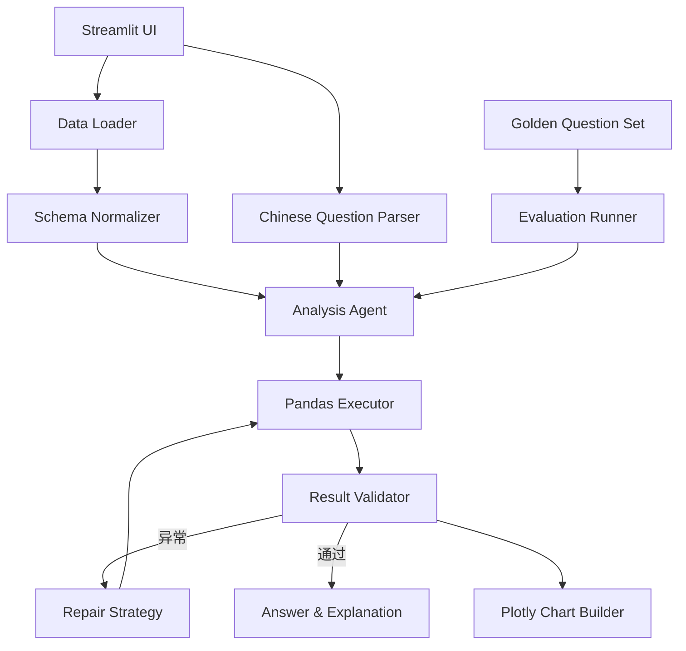
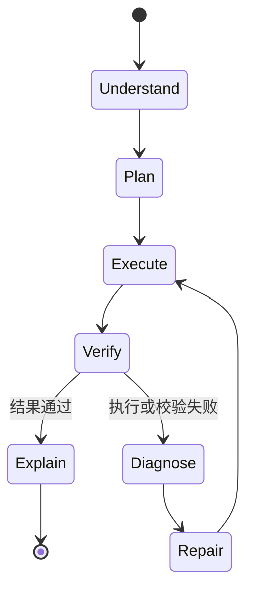

# 技术设计文档

## 1. 设计目标

产品需要同时满足四个条件：

1. **真的计算：** 答案必须来自用户上传的数据，不是模型猜测。
2. **过程透明：** 业务人员能看到问题如何被理解、数据如何被筛选、结果如何被验证。
3. **可恢复：** 单个字段或数据类型异常不能让整个页面崩溃。
4. **可评测：** 同一批问题能重复运行并与固定答案比较。

## 2. 系统架构



## 3. 自然语言意图模型

每个问题被解析为结构化 `AnalysisIntent`：

```python
{
    "metric": "签约额",
    "aggregation": "sum",
    "group_by": ["设计风格"],
    "filters": {},
    "year": 2025,
    "month": None,
    "top_n": 3,
    "sort_desc": True,
    "chart_type": "bar",
    "scope": "valid"
}
```

这层结构是自然语言和数据计算之间的“合同”。界面可以解释它，执行器可以稳定运行它，评测器也能单独判断意图是否正确。

## 4. 数据处理

### 字段标准化

`data_loader.py` 处理：

- Excel / CSV / TSV 读取；
- 常见中文字段别名映射；
- 日期和金额类型转换；
- 货币符号、千分位和“元”字符清理；
- 缺少毛利额时的自动补算；
- 年、月、季度衍生字段；
- 有效合同口径。

### 安全执行

程序不会执行用户输入的任意 Python 或 SQL。问题只能被转换成预定义、可审计的 Pandas 聚合动作，从而避免代码注入和不可控计算。

## 5. Agent 循环



校验包括：

- 结果表不能无故为空；
- 指标列必须存在；
- 指标不能全部是空值；
- 总签约额与原明细独立 `sum()` 复算一致；
- 项目数与筛选后的明细行数一致。

错误恢复包括：

- 字段别名自动映射；
- 数字/日期异常安全置空；
- 通过相似度匹配修复旧字段名；
- 捕获异常并返回友好信息，保持页面继续运行。

## 6. 图表策略

- 时间维度默认折线图；
- 分类比较默认柱状图；
- 明确要求占比时使用环形图；
- 金额统一换算为万元；
- 比率统一换算为百分比；
- 结果表保留底层精确数值。

## 7. 评测设计

评测不是检查回答中有没有某个关键词，而是同时检查：

1. 指标是否识别正确；
2. 分组维度是否识别正确；
3. 图表类型是否正确；
4. 结果行数是否一致；
5. 每一行分类和值是否与黄金答案一致；
6. 浮点数是否在严格误差范围内。

黄金答案保存在 `evaluation/golden_questions.json`，生成逻辑与 Agent 执行逻辑相互独立，避免“自己给自己打分”。

## 8. 技术选型

| 技术 | 用途 | 选择原因 |
| --- | --- | --- |
| Streamlit | 产品界面 | 快速、稳定，适合数据产品交互 |
| Pandas | 数据执行 | 分组聚合能力成熟，结果可复核 |
| Plotly | 交互图表 | 图表清晰并支持悬停查看精确数值 |
| openpyxl | 产品读取 Excel | 兼容常见 `.xlsx` 文件 |
| Artifact Tool | 生成演示 Excel | 支持公式、格式、表格和原生图表 |
| Pytest | 单元测试 | 轻量、可自动化 |

## 9. 扩展方向

- 接入企业级语义模型，覆盖更自由的复杂问法；
- 增加同比、环比、转化率和目标达成率；
- 支持多表关联（线索、签约、施工、回款）；
- 增加权限控制、数据脱敏和操作审计；
- 保存问题模板和经营看板；
- 部署为内网服务或容器化应用。

